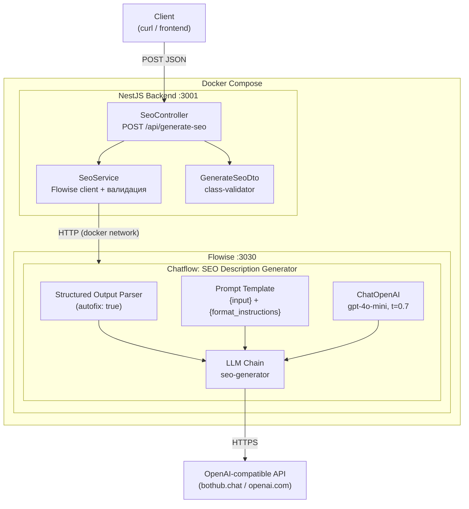
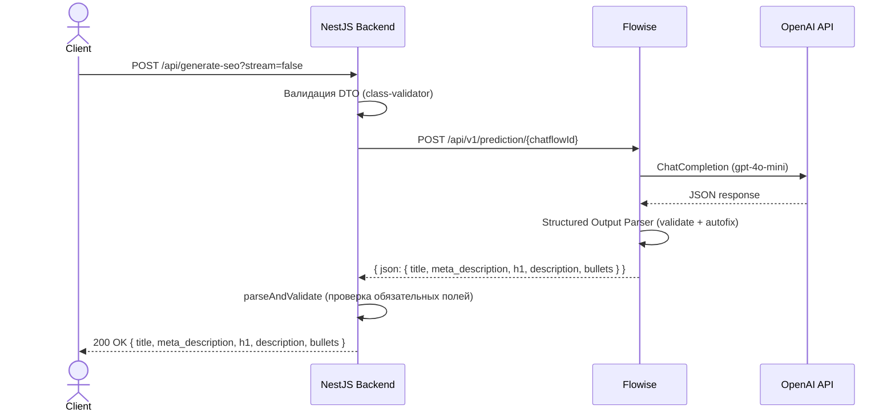
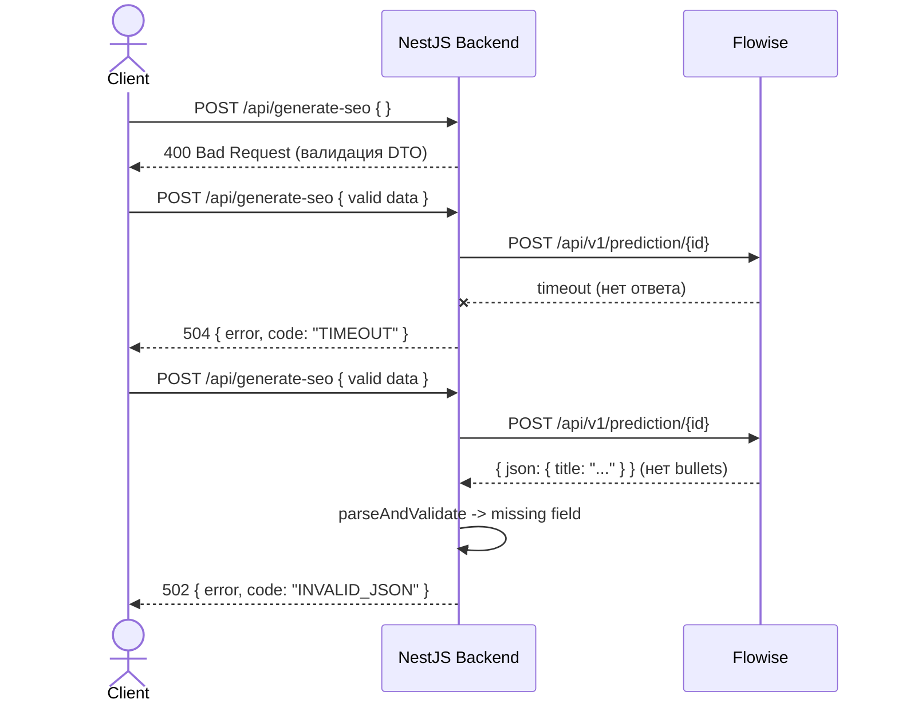

# SEO Description Generator

Генератор SEO-описаний товаров на базе **Flowise** (LLM-оркестратор) + **NestJS** (API-сервер).

## Задание

> Реализовать "Генератор SEO-описания товара":
> 1. Flowise-чатфлоу: prompt template с переменными, подключённый к LLM chain со structured output parser. Вернуть JSON: `{ title, meta_description, h1, description, bullets }`.
> 2. NestJS endpoint `POST /api/generate-seo` — принимает данные, вызывает Flowise Prediction API, возвращает результат.
> 3. Базовая обработка ошибок: таймаут, пустой ответ от LLM, невалидный JSON.

## Стек и инструменты

| Компонент | Технология | Зачем |
|-----------|-----------|-------|
| LLM-оркестратор | Flowise 2.2.7 | Визуальное построение LLM-цепочек, Prediction API |
| LLM | gpt-4o-mini (через Bothub proxy) | Баланс цена/качество для генерации SEO-текстов |
| Backend | NestJS 10 + TypeScript | Валидация, обработка ошибок, SSE-стриминг |
| Контейнеризация | Docker Compose | Единая среда запуска |

## Архитектура

### Компонентная диаграмма



### Sequence-диаграмма (non-streaming)



### Sequence-диаграмма (обработка ошибок)



## Быстрый старт

### 1. Клонировать и настроить

```bash
cp .env.example .env
# Отредактировать .env: установить FLOWISE_PORT (если 3000 занят)
```

### 2. Запустить контейнеры

**Production:**
```bash
docker-compose up -d --build
```

**Development** (Hot Module Replacement — изменения в `backend/src/` подхватываются без перезапуска):
```bash
docker-compose -f docker-compose.dev.yml up -d --build
```

### 3. Настроить Flowise

1. Открыть http://localhost:3030 — пройти начальную регистрацию
2. **Credentials** → Add New → **OpenAI API** → вставить API Key
   - В **Additional Parameters** → **BasePath**: URL провайдера (например `https://bothub.chat/api/v1/openai/v1`)
3. **Settings** (⚙) → **Import** → выбрать `flowise/ExportData.json`
4. Открыть импортированный chatflow **"SEO Description Generator"**
5. В ноде **ChatOpenAI** → выбрать созданный Credential → **Save**
6. Скопировать ID chatflow из URL (после `/chatflows/`)
7. Вставить в `.env`:
   ```
   FLOWISE_CHATFLOW_ID=<скопированный_id>
   ```
8. Перезапустить backend:
   ```bash
   docker-compose restart backend
   ```

### 4. Проверить

```bash
curl -X POST "http://localhost:3001/api/generate-seo?stream=false" \
  -H "Content-Type: application/json" \
  -d '{"product_name":"iPhone 15 Pro","category":"Смартфоны","keywords":"apple, iphone, флагман, камера, титан"}'
```

## API

### `POST /api/generate-seo`

**Request:**

```json
{
  "product_name": "iPhone 15 Pro",
  "category": "Смартфоны",
  "keywords": "apple, iphone, флагман, камера, титан"
}
```

Все поля обязательны, строки, не пустые. Лишние поля отклоняются (400).

**Non-streaming** (`?stream=false`):

```bash
curl -X POST "http://localhost:3001/api/generate-seo?stream=false" \
  -H "Content-Type: application/json" \
  -d '{"product_name":"Samsung Galaxy S24 Ultra","category":"Смартфоны","keywords":"samsung, galaxy, AI, камера"}'
```

Ответ:

```json
{
  "title": "Samsung Galaxy S24 Ultra - The Future of Mobile Technology",
  "meta_description": "Discover the Samsung Galaxy S24 Ultra, a revolutionary smartphone featuring advanced AI capabilities, stunning display, and unrivaled performance.",
  "h1": "Samsung Galaxy S24 Ultra: Unleash the Power of AI",
  "description": "Experience the Samsung Galaxy S24 Ultra, where cutting-edge technology meets stunning design. With powerful AI features, this smartphone redefines what a device can do.",
  "bullets": [
    "Stunning 6.8-inch AMOLED display",
    "Advanced AI camera capabilities",
    "Long-lasting battery life",
    "Lightning-fast performance",
    "Stylish and durable design"
  ]
}
```

**Streaming** (default, SSE):

```bash
curl -N -X POST http://localhost:3001/api/generate-seo \
  -H "Content-Type: application/json" \
  -d '{"product_name":"MacBook Air M3","category":"Ноутбуки","keywords":"apple, macbook, ультрабук"}'
```

Ответ — SSE-поток:

```
event: end
data: {"result":{"title":"Apple MacBook Air M3 - Sleek, Powerful & Lightweight","meta_description":"Discover the new Apple MacBook Air M3...","h1":"Apple MacBook Air M3","description":"Experience the cutting-edge technology...","bullets":["Powerful M3 chip","Ultra-light design","Retina display","Long battery life","Fast SSD storage"]}}
```

> Flowise LLM Chain не поддерживает потоковую генерацию напрямую, поэтому SSE-режим возвращает результат одним событием `end` после завершения генерации. Бэкенд корректно обрабатывает оба формата ответа (SSE-поток и plain JSON).

## Обработка ошибок

### Валидация входных данных (400)

```bash
curl -X POST http://localhost:3001/api/generate-seo \
  -H "Content-Type: application/json" -d '{}'
```

```json
{
  "message": [
    "product_name should not be empty",
    "product_name must be a string",
    "category should not be empty",
    "category must be a string",
    "keywords should not be empty",
    "keywords must be a string"
  ],
  "error": "Bad Request",
  "statusCode": 400
}
```

### Лишние поля отклоняются (400)

```bash
curl -X POST "http://localhost:3001/api/generate-seo?stream=false" \
  -H "Content-Type: application/json" \
  -d '{"product_name":"Test","category":"Test","keywords":"test","extra":"hack"}'
```

```json
{
  "message": ["property extra should not exist"],
  "error": "Bad Request",
  "statusCode": 400
}
```

### Таблица ошибок от Flowise

| Код | HTTP | Когда |
|-----|------|-------|
| `TIMEOUT` | 504 | Flowise не ответил за `FLOWISE_TIMEOUT_MS` мс |
| `EMPTY_RESPONSE` | 502 | LLM вернул пустой ответ |
| `INVALID_JSON` | 502 | LLM вернул невалидный JSON или отсутствуют обязательные поля |
| `SERVICE_UNAVAILABLE` | 503 | Flowise недоступен или вернул HTTP-ошибку |

При SSE-стриминге ошибки приходят как event:

```
event: error
data: {"error":"Flowise did not respond within 60000ms","code":"TIMEOUT"}
```

## Обоснование выбора параметров

### LLM: gpt-4o-mini, temperature 0.7, max_tokens 1024

- **gpt-4o-mini** — оптимальный баланс цена/качество для SEO-текстов. Быстрый, дешёвый (~$0.15/1M input tokens), хорошо следует инструкциям и генерирует валидный JSON.
- **temperature 0.7** — SEO-тексты требуют креативности (уникальные формулировки), но должны оставаться когерентными. 0.7 — стандарт для marketing copy.
- **max_tokens 1024** — SEO-пакет занимает ~300-500 токенов. 1024 даёт запас без риска runaway generation.

### Structured Output Parser с autofix

- Parser инжектит `format_instructions` в промпт, давая LLM точный пример формата. Надёжнее, чем просто "верни JSON".
- **autofix: true** — при невалидном ответе Flowise автоматически делает retry с описанием ошибки, снижая процент невалидных ответов.

### Flowise vs прямой OpenAI SDK

Flowise выбран согласно условию задания (визуальный chatflow). В production-проектах использую OpenAI SDK напрямую (`openai` npm) — это даёт больше контроля:

- Прямой вызов `chat.completions.create()` без промежуточного слоя
- Свой pipeline парсинга: extraction JSON-блоков из ответа → `jsonrepair` для восстановления сломанного JSON → нормализация полей
- Двухуровневая модель: gpt-4o-mini для быстрых задач, gpt-4o для глубокого анализа с большим контекстом (32k tokens)
- Поддержка нескольких провайдеров с fallback (основной + резервный через `baseURL`)

Flowise удобен для прототипирования и визуализации цепочек, но добавляет overhead:

- **Latency** — ~100-200ms на промежуточный HTTP-запрос
- **Стриминг** — Flowise стоит между backend и LLM, поэтому нужен ручной парсинг SSE (`eventsource-parser` + `async *` генератор). При прямом вызове OpenAI SDK стриминг работает из коробки — SDK сам держит соединение, парсит SSE и отдаёт типизированные чанки через `for await...of`
- **Гибкость** — `overrideConfig.promptValues` не работает с LLM Chain в Flowise v2.x, пришлось передавать данные через `question`

### Передача данных через question

Flowise 2.x LLM Chain не поддерживает `overrideConfig.promptValues` для подстановки переменных в Prompt Template. Поэтому данные о товаре передаются как структурированный текст в поле `question`, а промпт использует переменную `{input}` для их приёма.

## Конфигурация (.env)

| Переменная | Описание | Default |
|-----------|----------|---------|
| `FLOWISE_API_URL` | URL Flowise внутри docker-сети | `http://flowise:3000` |
| `FLOWISE_PORT` | Порт Flowise на хосте | `3030` |
| `BACKEND_PORT` | Порт backend на хосте | `3001` |
| `FLOWISE_USERNAME` | Логин Flowise (опционально) | — |
| `FLOWISE_PASSWORD` | Пароль Flowise (опционально) | — |
| `FLOWISE_CHATFLOW_ID` | ID импортированного chatflow | — |
| `FLOWISE_TIMEOUT_MS` | Таймаут запроса к Flowise (мс) | `60000` |
| `OPENAI_BASE_PATH` | URL OpenAI-совместимого провайдера (опционально) | — |
| `CORS_ORIGIN` | Разрешённый origin для CORS | `*` |

## Тесты

36 юнит-тестов (Jest) покрывают всю логику бэкенда.

```bash
cd backend && npm test
```

| Файл | Тестов | Что покрывает |
|------|--------|---------------|
| `seo.service.spec.ts` | 20 | Парсинг ответа Flowise (`json`/`text`), bullets (строка/массив), таймаут, пустой ответ, невалидный JSON, retry при 502/503, SSE-стриминг (token events, JSON из буфера, пустой стрим), auth header, basePath override, защита от утечки LLM output |
| `seo.controller.spec.ts` | 9 | HTTP-статусы (200/502/503/504/500), SSE-заголовки, стриминг ошибок |
| `generate-seo.dto.spec.ts` | 7 | Обязательные поля, пустые значения, неверные типы |

Pre-commit хук (husky) автоматически запускает тесты перед каждым коммитом.

## Структура проекта

```
test-marpla/
├── .env.example                  # Шаблон конфигурации
├── .gitignore
├── docker-compose.yml            # Flowise + Backend (production)
├── docker-compose.dev.yml        # Dev-режим с HMR
├── flowise/
│   ├── ExportData.json           # Экспорт chatflow для импорта в Flowise
│   └── import.sh                 # Скрипт-помощник для настройки
├── package.json                  # Husky + корневые скрипты
├── backend/
│   ├── package.json
│   ├── tsconfig.json
│   ├── Dockerfile                # Multi-stage build (Node 20 Alpine)
│   ├── webpack-hmr.config.js     # Hot Module Replacement для dev
│   └── src/
│       ├── main.ts               # Bootstrap + ValidationPipe + CORS
│       ├── app.module.ts         # ConfigModule + SeoModule
│       └── seo/
│           ├── seo.module.ts
│           ├── seo.controller.ts      # POST /api/generate-seo (SSE + JSON)
│           ├── seo.controller.spec.ts # Тесты контроллера
│           ├── seo.service.ts         # Flowise client, парсинг, валидация
│           ├── seo.service.spec.ts    # Тесты сервиса
│           └── dto/
│               ├── generate-seo.dto.ts      # Валидация входных данных
│               └── generate-seo.dto.spec.ts # Тесты DTO
└── README.md
```
